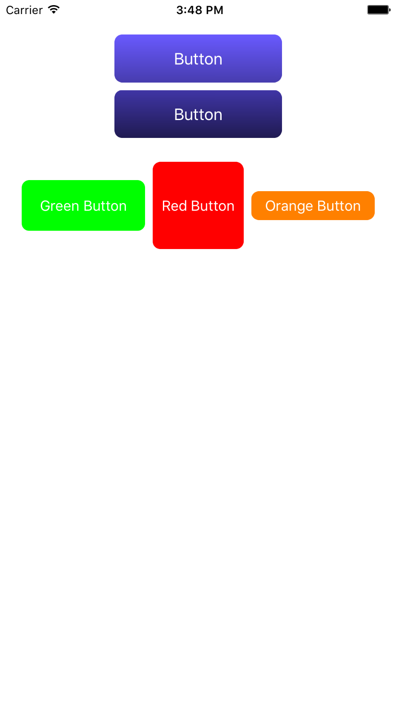
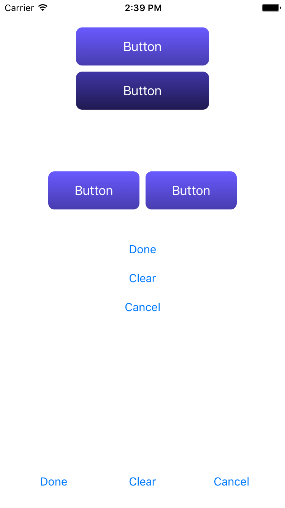
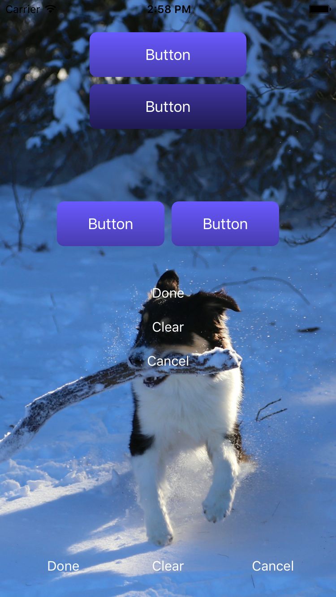
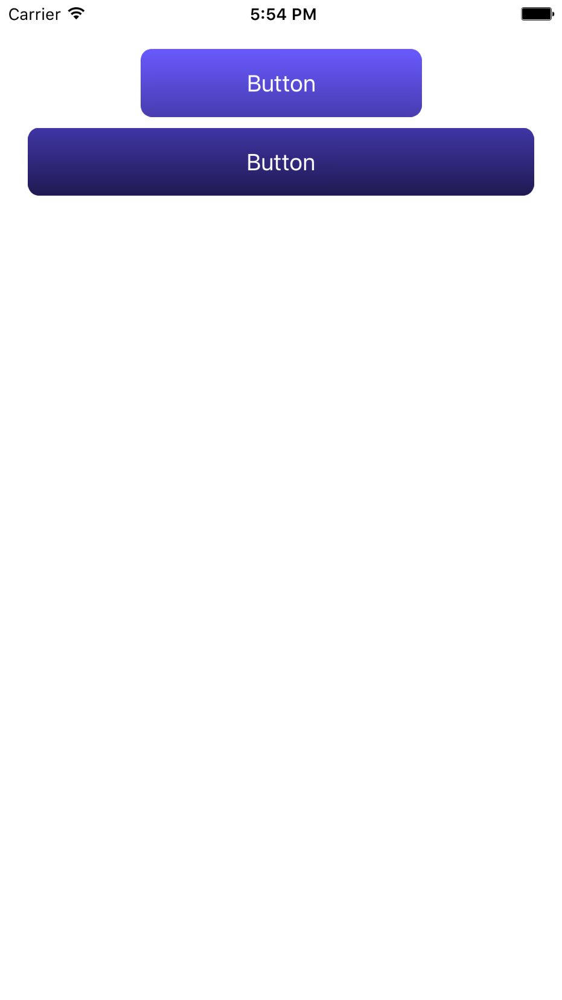
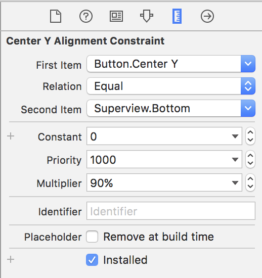

# 1.0 Lesson - Auto Layout for Beginners #

Paul Solt - [Paul@SuperEasyApps.com](mailto:Paul@SuperEasyApps.com)
[SuperEasyApps.com](http://SuperEasyApps.com)

-----

* [1.0 Lesson - Auto Layout for Beginners](LINK)

## 1.1 Lecture - Auto Layout for Beginners ##

Auto Layout is a way of describing the rules of your apps UI to your iPhone. Auto Layout enables your UI to adapt to the different sizes and orientations that your iPhone (or iPad) app might be in.

## 1.2 Tutorial - How to Design Button Graphics in Sketch ##

You can use any image editor tool to create artwork for your iPhone apps, or you can buy UI designs online, or hire a graphic designer. I prefer to use Sketch because it allows me to quickly export art assets in the required sizes for iPhone apps.

1. A normal system button on iPhone has a height around 30 points tall
	1. On iPhone 6S+ with a 3x scale that is 90 pixels tall
	2. On iPhone 6S with a 2x scale that is 60 pixels tall
2. iPad buttons might be 15-25% bigger than iPhone buttons

### Links ###

* [Sketch 3 for Mac](http://www.sketchapp.com)

## 1.3 Tutorial - How to Import New Buttons Background Images Into Xcode ##

1. Add images to the Asset Catalog by drag-and-drop
2. Import Xcode project images into the Asset Catalog
3. Add Slicing to Resizable Images

## 1.4 Tutorial - How to Create Custom Buttons in Xcode ##

A default button in Xcode is going to be a text button. You can customize it so that there is a background image and non-standard size.

1. Create a new button
2. Change the type to Custom
3. Change any font or color attributes
4. Set both a Default and Highlighted background image

### Buttons Using Template Images ###

Using a flat color image you can create a template image using the asset catalog.

1. Create a 30x30 size solid color button image
2. Add to Asset Catalog
3. Slice in vertical and horizontal directions
4. In Xcode set a button's background to the Template image
5. On the button change the tint color
6. Note: the tint color is only applied when you run the app, not in storyboard or preview

## 1.5 Tutorial - How to Align Content Using Stack Views ##

The Stack View is a new addition to iPhone UI that helps you layout content vertically or horizontally. It helps reduce the amount of layout constraints you need to specify for similar content. 

### 1. Horizontal Stack Views
1. Create two copies of the button
2. Align them side by side and press add to StackView button
3. Adjust the Fill mode to `Fill Equally`
4. Change the width constraints to make the buttons shorter
5. Set the spacing: 8 points
6. Add Auto Layout to center the Button StackView horizontally 

### 2. Vertical Stack Views ###

1. Create three new system buttons: Done, Clear, and Cancel
2. Add to Stack View
3. Set Fill mode to `Fill Equally`
4. Set spacing: 8 points

### 3. Horizontal Filled Stack Views

1. Duplicate the Vertical Button Stack View
2. Change it to Horizontal
3. Add a Leading constraint and a trailing constraint (Document Outline)

## 1.6 Tutorial - How to Create Background Images and Layers ##

You can arrange the views and UI controls in your iPhone app. The Document Outline will show you the order of the views that you adjust via drag-and-drop.

1. The topmost views (layer) is at the bottom of the subview list
2. Painters algorithm means the first view (top of subview list) is drawn first until the last view
3. Add a UIImageView
4. Drag its size to match the size of your canvas
5. Add Auto Layout constraints (top, button, leading, and trailing)
	1. Hold `Alt` key when adding trailing and leading to avoid margin
6. You can lock a layer on the Identity Inspector panel (prevents moving background image)
7. Change the button title colors to white

## 1.7 Tutorial - How to Create Percentage-Based Widths ##

You can create percentage-based widths for your app UI using the multiplier value.

1. Add a Equal Widths between the button and the view
2. Select and Double click the Equal Widths constraint to edit it 
3. Switch to the Size Inspector (ruler icon)
4. Make the button the first item (reverse in dropdown menu)
5. Set the Multiplier to 50% or 80% (make sure Constant is 0)

## 1.8 Tutorial - How to Create Percentage-Based Positions ##

You can also position content using percentages of the entire screen height (or width) using the center constraints.

1. Add a center vertically constraint to adjust the Y position
2. Edit the center constraint (Size Inspector)
3. Make the button the first item (reverse if necessary)
4. Change the superview (or containing view) from the center attribute to bottom
5. Set the Multiplier to 50% or 90% based on your UI designs