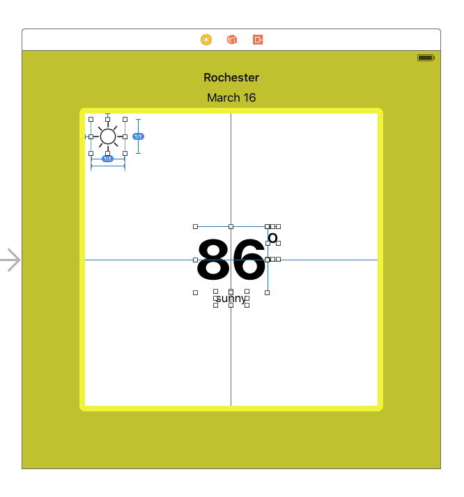

# Lesson 2 - Weather App UI #

Paul Solt - [Paul@SuperEasyApps.com](mailto:Paul@SuperEasyApps.com)
[SuperEasyApps.com](http://SuperEasyApps.com)

-----

* [2.0 Lesson - Weather App UI and Auto Layout](http://courses.supereasyapps.com/courses/chapter-2-super-easy-app-ui/lectures/882350)

## 2.1 Lecture - Weather App and Auto Layout##

You will learn how to create the UI (user interface) for a simple weather app. You can use Auto Layout to design the look and feel of your app, and its appearance on different sized iPhone devices.

## 2.2 Lecture - Design the Weather App UI ##

The first step is to block out the user interface using the Storyboard file. Add the key components and put them in temporary positions. You'll update these positions using Auto Layout in the next step.

1. Set the background color to a bright yellow color: #F0F418
2. Add a city UILabel to the top middle
	1. Text: Your city name (i.e.: "Rochester")
3. Add a date UILabel centered below the city label
	1. Text: Today's date (i.e.: "March 16")
4. Add a white UIView to the center:
	1. Size: 400x400 points
	2. Rename it to: "WeatherView"
5. Inside the white subview add:
	1. Add a UIImageView to hold the current weather icon
		1. Size: 50x50 points
		2. Position: top left corner
	2. Add a weather temperature UILabel in the center
		1. Set the text: "86"
		2. Font: System Bold 80.0
	3. Add a degree UILabel to the top right corner of the temperature label
		1. Text: Use the keyboard shortcut: `Alt + 0`: "º"
		2. Font: System 40.0
	4. Add a weather summary UILabel centered below the temperature label
		1. Text: "Sunny"
		2. Font: System 17.0

## 2.3 Lecture - Add Weather Images to Asset Catalog ##

Add the weather icons to your asset catalog. There are three images for each weather icon:

1. 1x (no @1x extension)
2. 2x (retina icon for iPhone 4S to iPhone 6S)
3. 3x (retina icon for iPhone 6S+)

## 2.4 Lecture - Create Auto Layout Constraints for Adaptive UI ##

Your UI needs to adapt to different screen sizes. On iPhone you can't design for static pixel positions, instead you will establish rules for where UI needs to move. You can setup relative positions and widths to enable your UI to adapt to wider or taller iPhones.

### Auto Layout Part 1 ###

1. Date and City labels
	1. Add constraints to center horizontally and vertically
2. WeatherView
	1. Center vertically and horizontally
	2. Add aspect ratio: 1:1
	3. Equal widths to view (containing view)
		1. Constant: 0
		2. Multiplier: 70%
3. Update frames using: `Command + Option + =`

### Auto Layout Part 2 ###

1. Weather icon
	1. Add the leading and top space to container constraints
	2. Add width: 50
	3. Add aspect ratio: 1:1
2. Degree label
	1. Add a top layout constraint
	2. Add a horizontal spacing constraint with constant: 0
3. Weather summary
	1. Add a vertical spacing and center horizontally constraint
4. Center the white square inside the container (view)
5. Add a ratio percentage based 
6. Update the frames using: `Command + Option + =`

## 2.5 Bug Fix - Troubleshooting Auto Layout Constraints ##

If you make a mistake adding constraints you can end of with rules that confuse the iPhone layout. For example, you might tell a view to be 40 points wide and as a separate rule tell it that it must be 80 points wide. When layout constraints can't be followed you have unsatisfied constraints.

### Fix Constraints Quickly ###

1. Use undo: `Command + Z` 
2. Use redo: `Command + Shift + Z`
3. Remove all constraints for selected views and start over
4. Start over from the beginning and try again
5. Remove any constraints that are conflicting to resolve layout issues (delete key)
6. Resize labels using `Command + =` before adding constraints
7. Add more constraints to define both size and position
8. Update frames with `Option + Command + =`
9. Clipped "..." text: resize labels with `Command + =`

### Color Coded Constraints ###

1. Blue: constraints are good
2. Orange: constraints are missing (ambiguous layout)
3. Red: constraints are conflicting

## 2.6 Lecture - Size Classes and Auto Layout ##

Size classes allow you to make bigger UI changes to your application to support portrait and landscape orientations on iPhone. You can also provide a custom user interface for iPhone 6S+ and the iPad. Size classes are also important if your app supports popups or multitasking where your app can appear on the side of another app on iPad.

### Default Size Class ###

When you start an iPhone app you will see your storyboard has the Any x Any size class. It is best to design your UI using this size class to understand adaptive layouts.

### Four Size Classes ###

Size classes enable you to create custom, rearranged, or resized interfaces. Switch to one of these to further customize the look and feel. You can adjust font sizes, positions, and sizes of UIView elements.

1. Compact x Compact = iPhone Landscape
2. Compact x Regular = iPhone Portrait
3. Regular x Regular = iPad
4. Regular x Compact = iPhone 6S+

### Installing and Uninstalling Constraints ###

Don't delete views with the `Delete` key! It will break your working app UI for the other size classes!

You can customize size classes and redesign the layouts by installing or uninstalling constraints (`Command + Delete`). Or clicking on the checkbox next to `Install`.

### Careful Adapting Your User Interfaces ###

Size classes can help with landscape and portrait layouts, but there isn't an easy way to reset size class in Xcode. If you want to reset the layout for a size class, you need to remove constraints and views one by one.

1. You can add more constraints to smaller or larger size classes, just make sure you don't conflict with constraints in your other size classes.
2. Version control is really important (git + github) when you start doing more work with size classes.
3. You can remove changes for a size class by going through each view and constraint one by one uninstalling or deleting old constraints (grayed out views/constraints).

### Links ###

* [About Designing for Multiple Size Classes](https://developer.apple.com/library/ios/recipes/xcode_help-IB_adaptive_sizes/chapters/AboutAdaptiveSizeDesign.html#//apple_ref/doc/uid/TP40014436-CH6-SW1)
* [Adaptive User Interfaces - JessieSquires.com](http://www.jessesquires.com/adaptive-user-interfaces/)

## 2.7 Lecture - App Icons for App Store and iOS Devices ##

App Icons should be 1024x1024 big when you create them and you'll need to export smaller versions to include within Xcode. Using Sketch you can make new app icons at the resolution 1024x1024.

### Submitting an iPhone App ###

When you upload your app to Apple for the App Store or Test Flight, you must upload a 1024x1024 JPG or PNG image.

### iPhone App Icons ###

Your iPhone app project has an AppIcon entry in the Asset Catalog that has a list of all the sizes required (180x180 through 29x29). The easiest way to generate these icons is to use the Mac app, IconKit, to export the required files from your 1024x1024 icon.

### Adhoc App Icon ###

If you distribute your app Adhoc (not via TestFlight) you will need to add the iTunesArtwork and iTunesArtwork@2x (no extension) files to your Xcode project (not asset catalog).

### Links ###

* [Icon and Image Sizes - apple.com](https://developer.apple.com/library/ios/documentation/UserExperience/Conceptual/MobileHIG/IconMatrix.html)
* [App Icons on iPad and iPhone Technical Q&A - apple.com](https://developer.apple.com/library/ios/qa/qa1686/_index.html)
* [Sketch App - sketchapp.com](https://www.sketchapp.com)
* [IconKit - Mac App Store](https://itunes.apple.com/us/app/iconkit-icon-resizer-for-app/id507135296?mt=12)

## 2.8 Lecture - Background Images for the Weather App ##

You can add a background image for your weather app by adding new images and setting up a UIImageView to match the size of the screen with an aspect fill.

If you use images, you would need to have a collection of different images to cycle through based on the current weather conditions. Apple uses animated backgrounds, while other weather apps use images from Flickr.

## 2.9 Code Exercise - Calculator App UI With Auto Layout ##

Design a simple calculator layout using Xcode and setup the Auto Layout constraints so that it adapts to different sized iPhones in portrait orientation. Recreating the app UI for existing apps is a good way to learn how to design UI in Xcode, as well as setting up the constraints.

### Align and Pin Buttons ###

Take advantage of the Align and Pin buttons in the bottom right corner of Xcode to align and position multiple UI elements at the same time.

## 2.10 Solution - Calculator App UI With Auto Layout ##

As you add more UI elements to your app, it requires more time to setup the layout constraints. Make sure you preview the resulting app using the Preview mode in the Assistant Editor.

### Troubleshooting Auto Layout ###

* Rounding issues in Xcode can make some complex layouts look off
* Rounding issues with Preview can make layouts look incorrect (half pixels)
* Test on the iPhone simulators or real device to confirm actual layout
* Making some constraints 999 (optional) instead of 1000 (required) can help make UI "fail" at known points

### Links ###

* [Conflicting Layouts - apple.com](https://developer.apple.com/library/ios/documentation/UserExperience/Conceptual/AutolayoutPG/ConflictingLayouts.html) 

## 2.11 Quiz - App UI and Auto Layout ##

Take the quiz:

* 2.11 Quiz - App UI and Auto Layout
