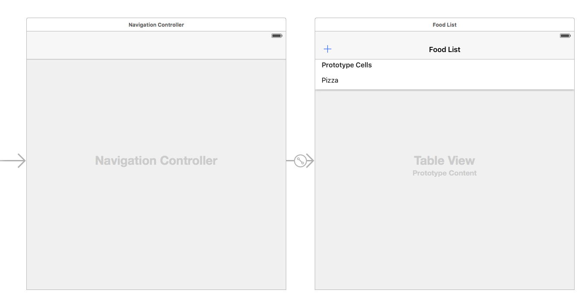
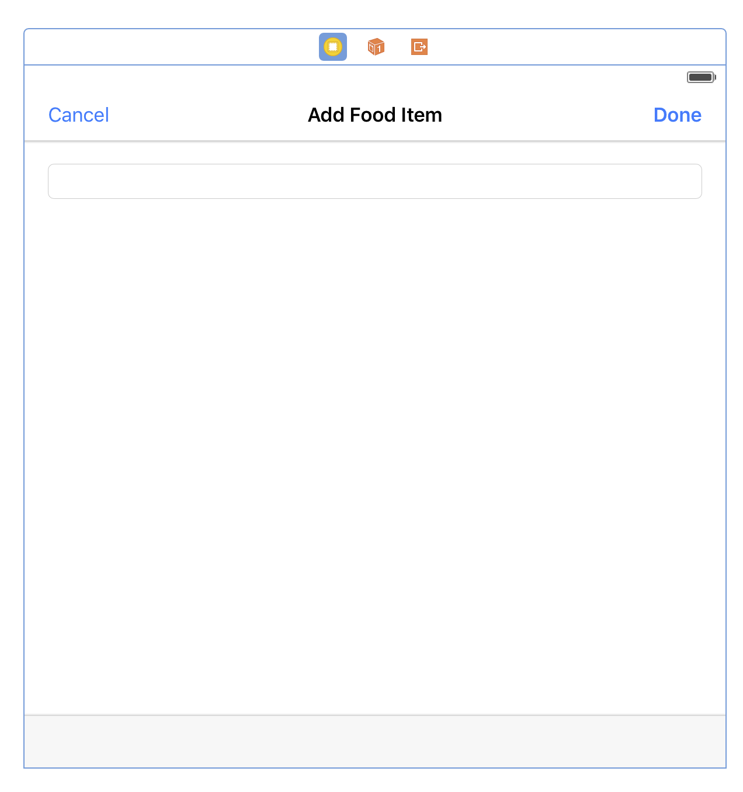

# 1.0 Lesson - Table Views for Beginners #

Paul Solt - [Paul@SuperEasyApps.com](mailto:Paul@SuperEasyApps.com)
[SuperEasyApps.com](http://SuperEasyApps.com)

-----

* 1.0 Lesson - Table Views for Beginners

## 1.1 Lecture - Introduction to the UITableView ##

In this lesson you will learn how to create a UITableView that can add and remove data from an array in your app. You will work with multiple screens and sharing information between screens.

## 1.2 Tutorial - Table View UI and Connections ##



1. Drag a UITableView onto your ViewController (Not TableViewController)
2. Add Auto Layout constraints
3. Add a UINavigationController (top bar)
4. Set the Navigation Root View Controller to the ViewController
5. Create a Prototype Cell (Default)
6. Add a reuse identifier: "FoodCell"
7. Add an Add (+) Bar Button Item to the top left corner
8. Change the name of the Navigation Controller to "FoodListNavigationController"
9. Make the FoodListNavigationController initial view controller


## 1.3 Tutorial - Table View Delegate and DataSource ##

1. Set the delegate and dataSource properties in viewDidLoad()

	```swift
	override func viewDidLoad() {
		super.viewDidLoad()
		foodTableView.delegate = self
		foodTableView.dataSource = self	
	}
	```

2. Make the ViewController conform to the delegate protocols UITableViewDelegate and UITableViewDataSource

	```swift
	class ViewController: UIViewController, UITableViewDelegate, UITableViewDataSource {
	```

3. Add the methods to show test data in the list

	```swift
	func tableView(tableView: UITableView, numberOfRowsInSection section: Int) -> Int {
		return 10
	}
	```

4. Create a row cell and add test data

	```swift
	func tableView(tableView: UITableView, cellForRowAtIndexPath indexPath: NSIndexPath) -> UITableViewCell {
		let cell = tableView.dequeueReusableCellWithIdentifier("FoodCell", forIndexPath: indexPath)
		cell.textLabel?.text = "Food"
		return cell
	}
	```

### Links ###

* [Table View Programming Guide for iOS](https://developer.apple.com/library/ios/documentation/UserExperience/Conceptual/TableView_iPhone/AboutTableViewsiPhone/AboutTableViewsiPhone.html#//apple_ref/doc/uid/TP40007451-CH1-SW1)
* [Table View Reference](https://developer.apple.com/library/ios/documentation/UIKit/Reference/UITableView_Class/index.html#//apple_ref/occ/cl/UITableView)
* [UITableViewDelegate Reference](https://developer.apple.com/library/ios/documentation/UIKit/Reference/UITableViewDelegate_Protocol/)
* [UITableViewDataSource Reference](https://developer.apple.com/library/ios/documentation/UIKit/Reference/UITableViewDataSource_Protocol/)

## 1.4 Tutorial - Table View Code Setup ##

1. Create your data or model array below your outlets, above viewDidLoad()

	```swift
	// Variables
	var foodArray = ["Pizza", "Hoagie", "Thai Curry", "Vegetables"]
	```

2. Update the tableView(_: numberOfRowsInSection:) method to use the foodArray's size

	```swift
	func tableView(tableView: UITableView, numberOfRowsInSection section: Int) -> Int {
		return foodArray.count
	}
	```

3. Update the tableView(_: cellForRowAtIndexPath:) method to populate the cell with the data

	```swift
	func tableView(tableView: UITableView, cellForRowAtIndexPath indexPath: NSIndexPath) -> UITableViewCell {
		let cell = tableView.dequeueReusableCellWithIdentifier("FoodCell", forIndexPath: indexPath)
		if indexPath.row < foodArray.count {
			cell.textLabel?.text = foodArray[indexPath.row]
			// cell also has an imageView + detailTextLabel properties
		}
		return cell
	}
	```

## 1.6 Tutorial - Design and Setup the AddFoodViewController ##

### Design the User Interface ###



1. Create a new AddFoodViewController.swift as a subclass of UIViewController
2. Drag a new View Controller in your Main.storyboard file
3. Set the new View Controller as a AddFoodViewController to link the code file
4. In the Main.storyboard set the AddFoodViewController's Simulated Metrics Top Bar to "Opaque Navigation Bar" instead of inferred
5. Drag a `UINavigationBar` onto the `AddFoodViewController`
6. Set the title to "Add Food Item"
7. Drag two Bar Button Items for the `Cancel` and `Done` buttons
8. Add a `UITextField` below the navigation bar
9. Setup Auto Layout constraints

### Connect the Code to UI ###

1. Create an Outlet for the `UITextField` called `foodTextField`

	```swift
	@IBOutlet weak var foodTextField: UITextField!
	```

2. Add two Actions for the `doneButtonPressed(_:)` and `cancelButtonPressed(_:)`

	```swift
	@IBAction func doneButtonPressed(sender: AnyObject) {
		print("done pressed")
	}
	
	@IBAction func cancelButtonPressed(sender: AnyObject) {
		print("cancel pressed")
	}
	```

## 1.7 Tutorial - Presenting a Modal View Controller

In the ViewController.swift file add code to show this new screen.

1. Add a Bar Button Item to add new foods to the ViewController
2. Create an action called `addButtonPressed(_:)`
3. Add the logic to create and show a the `AddFoodViewController`

	```swift
	@IBAction func addFoodItemPressed(sender: AnyObject) {
		let foodController = self.storyboard?.instantiateViewControllerWithIdentifier("AddFoodViewController") as! AddFoodViewController
		// wrap in a temporary navigation controller
		let navigationFoodController = UINavigationController(rootViewController: foodController)
		self.presentViewController(navigationFoodController, animated: true, completion: nil)
	}
	```


## 1.8 Tutorial - Delegate Protocols for Passing Messages ##

You will use a delegate protocol to communicate between the two code files.

1. Create a delegate protocol at the top of AddFoodViewController.swift

	```swift
	protocol AddFoodViewControllerDelegate {
		func foodController(foodController: AddFoodViewController, didAddFood food: String)
		func foodControllerDidCancel(foodController: AddFoodViewController)
	}
	```

2. Create a delegate property in AddFoodViewController.swift

	```swift
	var delegate: AddFoodViewControllerDelegate? = nil
	```

3. Call the delegate's methods in AddFoodViewController.swift

	```swift
	@IBAction func doneButtonPressed(sender: AnyObject) {
		if foodTextField.text?.isEmpty == false { // Don't exit without text
			delegate?.foodController(self, didAddFood: foodTextField.text!)
		}
	}
	
	@IBAction func cancelButtonPressed(sender: AnyObject) {
		delegate?.foodControllerDidCancel(self)
	}
	```

4. In ViewController.swift `addFoodButtonPressed(_:)` set the foodController.delegate property

	```swift
	@IBAction func addFoodButtonPressed(sender: AnyObject) {
		let foodController = self.storyboard?.instantiateViewControllerWithIdentifier("AddFoodViewController") as! AddFoodViewController
		foodController.delegate = self // required for delegate protocol message
		// wrap in a temporary navigation controller
		let navigationFoodController = UINavigationController(rootViewController: foodController)
		self.presentViewController(navigationFoodController, animated: true, completion: nil)
	}
	```

5. Conform to the AddFoodViewControllerDelegate protocol at the top of ViewController.swift

	```swift
	class ViewController: UIViewController, UITableViewDelegate, UITableViewDataSource, AddFoodViewControllerDelegate {
	```

6. Add method stubs for the two AddFoodViewControllerDelegate methods

	```swift
	func foodController(foodController: AddFoodViewController, didAddFood food: String) {
		print("Food: \(food)")
	}
	
	func foodControllerDidCancel(foodController: AddFoodViewController) {
		print("canceled")
	}
	```

### Links ###

* [Protocols](https://developer.apple.com/library/ios/documentation/Swift/Conceptual/Swift_Programming_Language/Protocols.html)
* [Delegation](https://developer.apple.com/library/ios/documentation/General/Conceptual/DevPedia-CocoaCore/Delegation.html)


## 1.9 Tutorial - Adding a New Food Item and Editing the Table View ##

1. Add logic to add the food item to the list in ViewController.swift
2. Dismiss the modal popup using the `dismissViewControllerAnimated(_:completion)` method

	```swift
	func foodController(foodController: AddFoodViewController, didAddFood food: String) {
		print("Food: \(food)")
		foodArray.append(food)
		let indexPath = NSIndexPath(forRow: foodArray.count - 1, inSection: 0)
		
		foodTableView.insertRowsAtIndexPaths([indexPath], withRowAnimation: .Automatic)
		dismissViewControllerAnimated(true, completion: nil)
	}
	
	func foodControllerDidCancel(foodController: AddFoodViewController) {
		print("canceled")
	
		dismissViewControllerAnimated(true, completion: nil)
	}
	```

### Links ###

* [Inserting and Deleting Rows and Sections - apple.com](https://developer.apple.com/library/ios/documentation/UserExperience/Conceptual/TableView_iPhone/ManageInsertDeleteRow/ManageInsertDeleteRow.html)

## 1.10 Enable Editing of the Table View ##

1. Add the default `editButtonItem` to the top right bar button item using code in viewDidLoad() of ViewController

	```swift
	override func viewDidLoad() {
		super.viewDidLoad()
		foodTableView.delegate = self
		foodTableView.dataSource = self
		navigationItem.rightBarButtonItem = self.editButtonItem()
	}
	```

2. Make an outlet for the addButton at the top of ViewController.swift

	```swift
	@IBOutlet weak var addButton: UIBarButtonItem!
	```
 
3. Override Apple's method setEditing(_: animated) to change states

	```swift
	// Editing
	override func setEditing(editing: Bool, animated: Bool) {
		super.setEditing(editing, animated: animated)
		if editing {
			addButton.enabled = false
		} else {
			addButton.enabled = true
		}
		foodTableView.setEditing(editing, animated: animated)
	}
	```


## 1.11 Tutorial - Removing Items From the List ##

1. Enable row editing for all rows by implementing the method

	```swift
	func tableView(tableView: UITableView, canEditRowAtIndexPath indexPath: NSIndexPath) -> Bool {
		return true
	}
	```

2. Enable row deletion by returning the editing style

	```swift
	func tableView(tableView: UITableView, editingStyleForRowAtIndexPath indexPath: NSIndexPath) -> UITableViewCellEditingStyle {
		return .Delete
	}
	```

3. Add code to remove an entry from the foodArray as well as the tableView

	```swift
	func tableView(tableView: UITableView, commitEditingStyle editingStyle: UITableViewCellEditingStyle, forRowAtIndexPath indexPath: NSIndexPath) {
		
		if editingStyle == .Delete {
			// remove from array
			foodArray.removeAtIndex(indexPath.row)
			// remove from UI
			tableView.deleteRowsAtIndexPaths([indexPath], withRowAnimation: .Automatic)
		}
	}
	```

### Links ###

* [Inserting and Deleting Rows and Sections - apple.com](https://developer.apple.com/library/ios/documentation/UserExperience/Conceptual/TableView_iPhone/ManageInsertDeleteRow/ManageInsertDeleteRow.html)