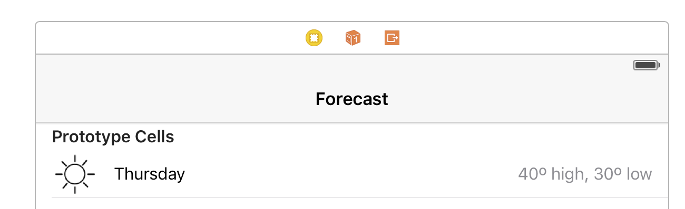
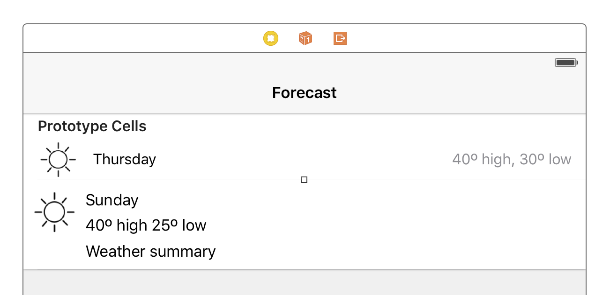

# 2.0 Lesson - Table Views for Weather Data #

Paul Solt - [Paul@SuperEasyApps.com](mailto:Paul@SuperEasyApps.com)
[SuperEasyApps.com](http://SuperEasyApps.com)

-----

* [2.0 Lesson - Table Views for Weather Data](http://courses.supereasyapps.com/courses/chapter-4-super-easy-table-views/lectures/936075)

## 2.1 Lecture - Table Views for Weather Data ##

In this lesson you will learn how to start using Table Views with the existing weather JSON data. Throughout the lesson you will learn more about data structure and how to display new information to the user.


## 2.2 Tutorial - Weather Forecast API Data ##

You need to refactor the app to support additional weather information. Your initial app worked well with a small amount of data, but now you need to parse more information. 

1. Create a new iOS Swift file called `WeatherDataBlock.swift`

	```swift
	import Foundation
	struct WeatherDataBlock {
		var summary: String?
		var icon: String?
		var dataPoints: [WeatherDataPoint]?
	}
	```
	
2. Create a new iOS Swift file called `WeatherForecast.swift`

	```swift
	import Foundation
	struct WeatherForecast {
		var currently: WeatherDataPoint?
		var daily: WeatherDataBlock?
		var hourly: WeatherDataBlock?
	}
	```
	
3. Add three new properties (date, maxTemperature, minTemperature) to the `WeatherDataPoint.swift`

	```swift
	import Foundation
	struct WeatherDataPoint {
		var temperature: Float?
		var summary: String?
		var icon: String?
		
		var date: NSDate?
		var maxTemperature: Float?
		var minTemperature: Float?
	}
	```

4. Create a group in Xcode to organize the new weather code files

## 2.2.1 Bug Fix - Update Your Dark Sky API Key ##

Make sure you update your API key in ViewController.swift if you use any of the solution code samples. The keys I use will not work for you.

```swift
// TODO: Set the API Key
let apiKey = "da898ac916d361151f95caa45c63f50e" // API KEY
```

### Links ###

* [Dark Sky Weather API](https://developer.forecast.io)
* [Chapter 3 Weather API Setup](http://courses.supereasyapps.com/courses/chapter-3-super-easy-app-data/lectures/896987)

## 2.3 Tutorial - Update WeatherDataPoint JSON Parsing ##

1. Add the code to parse a `WeatherDataPoint.swift` structure using the JSON data file.

	```swift
	struct WeatherDataPoint {
		var temperature: Float?
		var summary: String?
		var icon: String?
		
		var date: NSDate?
		var maxTemperature: Float?
		var minTemperature: Float?
		
		init(jsonData: [String : AnyObject]) {
			
			if let temperature = jsonData["temperature"] as? Float {
				print("temperature:", temperature)
				self.temperature = temperature
			}
			if let summary = jsonData["summary"] as? String {
				print("summary:", summary)
				self.summary = summary
			}
			if let icon = jsonData["icon"] as? String {
				print("icon:", icon)
				self.icon = icon
			}
			
			// Add low/high temperatures
			
			if let minTemperature = jsonData["temperatureMin"] as? Float {
				print("min temp:", minTemperature)
				self.minTemperature = minTemperature
			}
			
			if let maxTemperature = jsonData["temperatureMax"] as? Float {
				print("max temp:", maxTemperature)
				self.maxTemperature = maxTemperature
			}
			
			if let time = jsonData["time"] as? Double {
				
				self.date = NSDate(timeIntervalSince1970: time)
				
				print("date:", self.date!)
				print(dayFromDate(self.date!))
			}
		}
	}
	```

2. Create a new parseWeather(weatherJSON:) method in ViewController.swift to test the parsing

	```swift
	func parseWeather(weather: [String : AnyObject]) {
		if let currentWeather = weather["currently"] as? [String : AnyObject] {
			let dataPoint = WeatherDataPoint(jsonData: currentWeather)
			print("Current Weather", dataPoint)
		}
	}
	```

## 2.4 Tutorial - Parse the Weather Data Block ##

1. Add the init method to parse a data block to get access to the daily data.

	```swift
	struct WeatherDataBlock {
		var summary: String?
		var icon: String?
		var dataPoints: [WeatherDataPoint]?
		
		init(jsonData: [String : AnyObject]) {
			
			if let summary = jsonData["summary"] as? String {
				self.summary = summary
			}
			
			if let icon = jsonData["icon"] as? String {
				self.icon = icon
			}
			
			if let dataArray = jsonData["data"] as? [[String : AnyObject]] {
				print("dataArray")
				self.dataPoints = [WeatherDataPoint]()
				
				for data in dataArray {
					//				let dataPoint = parseDataPoint(data)
					let dataPoint = WeatherDataPoint(jsonData: data)
					self.dataPoints?.append(dataPoint)
				}
			}
		}
	}
	```

2. Test the parsing logic of weather data blocks in ViewController.swift

	```swift
	func parseWeather(weather: [String : AnyObject]) {
		if let currentWeather = weather["currently"] as? [String : AnyObject] {
			let dataPoint = WeatherDataPoint(jsonData: currentWeather)
			print("Current Weather", dataPoint)
		}
		
		if let dailyWeather = weather["daily"] as? [String : AnyObject] {
			let dataBlock = WeatherDataBlock(jsonData: dailyWeather)
			print("Daily Weather:", dataBlock)
		}
	}
	```


## 2.5 Tutorial - Parse the Weather Forecast Data ##

1. Parse the weather forecast in WeatherForecast.swift

	```swift
	struct WeatherForecast {
		var currently: WeatherDataPoint?
		var daily: WeatherDataBlock?
		var hourly: WeatherDataBlock?
		
		init(jsonData: [String : AnyObject]) {
			if let currentWeather = jsonData["currently"] as? [String : AnyObject] {
				print("currently:", currentWeather)
				self.currently = WeatherDataPoint(jsonData: currentWeather)
			}
			if let dailyWeather = jsonData["daily"] as? [String : AnyObject] {
				print("daily parsing")
				self.daily = WeatherDataBlock(jsonData: dailyWeather)
			}
		}
	}
	
	```

2. Test the weather forecast parsing in ViewController.swift

	```swift
	func parseWeather(weather: [String : AnyObject]) {
		let weatherForecast = WeatherForecast(jsonData: weather)
		print("Weather Forecast:", weatherForecast)
	}
	```

3. Update the UI using the current weather forecast

	```swift
	func parseWeather(weather: [String : AnyObject]) {
		let weatherForecast = WeatherForecast(jsonData: weather)
		
	//		print("Forecast:", weatherForecast)
		dispatch_async(dispatch_get_main_queue()) { 
			self.updateWeather(weatherForecast.currently!)
		}
	}
	```


## 2.6 Tutorial - Update the Current Weather Forecast ##

1. Store the weatherForecast on the main thread using a new property

	```swift
	var weatherForecast: WeatherForecast? = nil
	```
	
2. Create a new method `updateWeatherForecast()` to store the forecast

	```swift
	func updateWeatherForecast(weather: WeatherForecast?) {
		// Store the value
		self.weatherForecast = weather
		// Update the UI
	}
	```

3. Call the new method `updateWeatherForecast()` in the dispatch_async call, comment out the old method

	```swift
	func parseWeather(weather: [String : AnyObject]) {
		let weatherForecast = WeatherForecast(jsonData: weather)
		dispatch_async(dispatch_get_main_queue()) {
	//			self.updateWeather(weatherForecast.currently!)
			self.updateWeatherForecast(weatherForecast)
		}
	}
	```

4. Modify the `updateWeatherForecast()` method to set the temperature and summary.

	```swift
	func updateWeatherForecast(weather: WeatherForecast?) {
		// Store the value
		self.weatherForecast = weather
		// Update the UI
		
		if let weatherData = weatherForecast?.currently {
			
			if let temperature = weatherData.temperature {
				let numberFormatter = NSNumberFormatter()
				numberFormatter.maximumFractionDigits = 0
				
				temperatureLabel.text = numberFormatter.stringFromNumber(temperature) // String(temperature)
			}
			
			if let weatherSummary = weatherData.summary {
				summaryLabel.text = weatherSummary
			}
		}
	}
	```

5. Create a new code file `WeatherHelper.swift` to reuse the image logic (for multiple app screens)

6. Import UIKit and refactor the icon code into the new WeatherHelper.swift code file

	```swift
	import UIKit

	func weatherImageForIcon(icon: String) -> UIImage? {
		var image: UIImage? = nil
		switch(icon) {
		case "clear-day":
			image = UIImage(named: "Clear-Day")
		case "clear-night":
			image = UIImage(named: "Clear-Night")
		case "rain":
			image = UIImage(named: "Rain")
		case "snow":
			image = UIImage(named: "Snow")
		case "sleet":
			image = UIImage(named: "Sleet")
		case "wind":
			image = UIImage(named: "Wind")
		case "fog":
			image = UIImage(named: "Fog")
		case "cloudy":
			image = UIImage(named: "Cloudy")
		case "partly-cloudy-day":
			image = UIImage(named: "Partly-Cloudy-Day")
		case "partly-cloudy-night":
			image = UIImage(named: "Partly-Cloudy-Night")
		case "hail":
			image = UIImage(named: "Sleet")
		case "thunderstorm":
			image = UIImage(named: "Thunderstorm") // Lightning
		case "tornado":
			image = UIImage(named: "Cloudy") // you decide what fits best
			
		default:
			print("Error: unexpected icon name: \(icon)")
			image = nil		
		}
		return image
	}
	```

## 2.7 Tutorial - New Weather Forecast View Controller ##

In the Main.storyboard file:

1. Create a Navigation Controller named `Weather Navigation Controller`
2. Set the Root View Controller to the Current Weather View Controller 
3. Add a bar button item called "Forecast" to the top right corner
4. Connect an action named `forecastButtonPressed`

	```swift
	@IBAction func forecastButtonPressed(sender: AnyObject) {
	}
	```

5. Add a new View Controller to storyboard named `Forecast View Controller`
6. Insert a Table View into the Forecast View Controller
7. Resize the Table View and add Auto Layout constraints
8. Create a new ForecastViewController.swift code file
9. In Main.storyboard set the class for the Forecast View Controller to `ForecastViewController`
10. Set the Storyboard ID to `ForecastViewController`

## 2.8 Tutorial - Pass Data and Setup the Table View ##

1. Add an optional WeatherForecast property to ForecastViewController.swift named `weatherForecast`

	```swift
	var weatherForecast: WeatherForecast?
	```

2. In ViewController.swift add code to show the new screen (push view controller) and set the weather forecast data


	```swift
	@IBAction func forecastButtonPressed(sender: AnyObject) {
	
		let forecastViewController = storyboard!.instantiateViewControllerWithIdentifier("ForecastViewController") as! ForecastViewController
		
		// pass the data
		forecastViewController.weatherForecast = weatherForecast
		
		navigationController?.pushViewController(forecastViewController, animated: true)
	}
	```

3. Create prototype cell with the identifier `WeatherCell`

	
	
4. In ForecastViewController.swift connect a Table View outlet and set the tableView delegate and dataSource properties in the viewDidLoad() method

	```swift
	@IBOutlet weak var tableView: UITableView!
	override func viewDidLoad() {
		super.viewDidLoad()
		tableView.dataSource = self
		tableView.delegate = self
	}
	```

5. Conform to the protocols `UITableViewDelegate` and `UITableViewDataSource`

	```swift
	class ForecastViewController: UIViewController, UITableViewDelegate, UITableViewDataSource {
	```

6. Implement the required data source delegate methods for the daily weather data

	```swift
	func tableView(tableView: UITableView, numberOfRowsInSection section: Int) -> Int {
		if let rows = weatherForecast?.daily?.dataPoints?.count {
			return rows
		} else {
			return 0
		}
	}
	func tableView(tableView: UITableView, cellForRowAtIndexPath indexPath: NSIndexPath) -> UITableViewCell {
		let cell = tableView.dequeueReusableCellWithIdentifier("WeatherCell", forIndexPath: indexPath)
		return cell
	}
	```


## 2.9 Tutorial - Show the Seven Day Forecast ##

1. Clear the default properties for a reusable cell
2. Display the summary, image icon, and max temperature from the data

	```swift
	func tableView(tableView: UITableView, cellForRowAtIndexPath indexPath: NSIndexPath) -> UITableViewCell {
		let cell = tableView.dequeueReusableCellWithIdentifier("WeatherCell", forIndexPath: indexPath)
		
		// clear the cell
		cell.imageView?.image = nil
		cell.textLabel?.text = ""
		cell.detailTextLabel?.text = ""
		
		if let dailyDataArray = weatherForecast?.daily?.dataPoints {
			
			if indexPath.row < dailyDataArray.count {
				
				let dailyForecast = dailyDataArray[indexPath.row]
				
				if let summary = dailyForecast.summary {
					cell.textLabel?.text = summary
				}
				
				if let icon = dailyForecast.icon {
					cell.imageView?.image = weatherImageForIcon(icon)
				}
				
				if let temperatureMax = dailyForecast.maxTemperature {
					cell.detailTextLabel?.text = String(temperatureMax)
				}
			}
		}
		return cell
	}
	```


## 2.10 Tutorial - Create Custom Table View Cells ##

1. Create a new custom prototype cell
2. Create a new Cocoa Touch Class (subclass UITableViewCell) called `WeatherTableViewCell` (remove existing code)
3. Set the custom prototype cell's identifier to `CustomCell`
4. Set the row height to 96 points
5. Add an Image View and Labels to display weather forecast

	
	
6. Connect the Outlets to your new WeatherTableViewCell.swift code file

	```swift
	import UIKit
	class WeatherTableViewCell: UITableViewCell {
		// NOTE: can't use imageView, textLabel, or detailTextLabel since already used
		@IBOutlet weak var weatherImageView: UIImageView!
	    	@IBOutlet weak var dayLabel: UILabel!
		@IBOutlet weak var temperatureLabel: UILabel!
		@IBOutlet weak var weatherSummaryLabel: UILabel!
	}
	```

## 2.11 Tutorial - Auto Layout for Custom Table View Cells ##

1. Setup the layout constraints for the custom table view cell to describe width and height
2. Make the imageView 50x50 points
3. Set the height constraints of the top two labels
4. Allow the bottom label to be greater than or equal constraint
5. Make the bottom label have 0 lines (allows multiple lines and dynamic heights)


## 2.12 Tutorial - Dynamic Height for Custom Table View Cells ##

For dynamic heights of custom table view cells you must set the height information in addition to using Auto Layout.

1. Set the height and estimated height of each cell

	```swift
	func tableView(tableView: UITableView, estimatedHeightForRowAtIndexPath indexPath: NSIndexPath) -> CGFloat {
		return 96
	}
	
	func tableView(tableView: UITableView, heightForRowAtIndexPath indexPath: NSIndexPath) -> CGFloat {
		return UITableViewAutomaticDimension
	}
	```

2. Setup the new custom cells in `cellForRowAtIndexPath`

	```swift
	func tableView(tableView: UITableView, cellForRowAtIndexPath indexPath: NSIndexPath) -> UITableViewCell {
		let cell = tableView.dequeueReusableCellWithIdentifier("CustomCell", forIndexPath: indexPath) as! WeatherTableViewCell
	
		return cell
	}
	```


## 2.13 Bug Fix - Dynamic Table View Cell Height Auto Layout Constraints ##

1. Layout must have all height information specified
2. Find missing vertical constraints and add them

## 2.14 Bug Fix - Multiple Labels With Multiple Lines of Text Auto Layout Constraints ##

1. Set the number of lines for the label to 0 (not 1)
2. Make the height constraint greater than or equal to the current height


## 2.15 Bug Fix - Resizing a Label and Adjusting Table View Cell Height ##

1. Remove the bottom vertical constraint (or views may disappear)
2. Change a font size
3. Resize the label to fit content (Command + =)
4. Adjust the width
5. Update the new height constraint (+12)
6. Be careful with updating the constraints for frames
7. Calculate new cell height and update estimated height

## 2.16 Tutorial - Show the Weather Forecast Data in Custom Table View Cells ##

1. Setup the new custom cells in `cellForRowAtIndexPath`

	```swift
	func tableView(tableView: UITableView, cellForRowAtIndexPath indexPath: NSIndexPath) -> UITableViewCell {
		let cell = tableView.dequeueReusableCellWithIdentifier("CustomCell", forIndexPath: indexPath) as! WeatherTableViewCell
		
		// clear the settings
		cell.weatherImageView.image = nil
		cell.dayLabel.text = ""
		cell.weatherSummaryLabel.text = ""
		cell.temperatureLabel.text = ""
		
		if let dailyDataArray = weatherForecast?.daily?.dataPoints {
			
			if indexPath.row < dailyDataArray.count {
				
				let dailyForecast = dailyDataArray[indexPath.row]
				
				if let summary = dailyForecast.summary {
					cell.weatherSummaryLabel.text = summary
				}
				
				if let icon = dailyForecast.icon {
					cell.weatherImageView.image = weatherImageForIcon(icon)
				}
				
				if let minTemperature = dailyForecast.minTemperature,
					let maxTemperature = dailyForecast.maxTemperature {
					
					let minTempRounded = Int(round(minTemperature))
					let maxTempRounded = Int(round(maxTemperature))
					
					cell.temperatureLabel.text = "\(maxTempRounded)º \(minTempRounded)º"
				}
			}
		}
		return cell
	}
	```

## 2.17 Tutorial - Display the Day for the Current Date ##

1. Add a method to calculate the day from the current date

	```swift
	func dayFromDate(date: NSDate) -> String {
		let dateFormatter = NSDateFormatter()
		dateFormatter.dateFormat = "EEEE" // h:mm:ss ZZZ"
		dateFormatter.timeZone = NSTimeZone.localTimeZone()
		
		let dateString = dateFormatter.stringFromDate(date)
		return dateString
	}
	```

2. Update the ForecastViewController.swift cellForRowAtIndexPath to set the date using the new helper method

	```swift
	if let date = dailyForecast.date {
		cell.dayLabel.text = dayFromDate(date)
	}
	```
					
3. Prevent highlighting rows

	```swift
	func tableView(tableView: UITableView, shouldHighlightRowAtIndexPath indexPath: NSIndexPath) -> Bool {
		return false
	}
	```

### Links ###

* [Date Formatting Symbols](http://www.unicode.org/reports/tr35/tr35-31/tr35-dates.html#Date_Format_Patterns)
* [Table View Programming Guide](https://developer.apple.com/library/ios/documentation/UserExperience/Conceptual/TableView_iPhone/AboutTableViewsiPhone/AboutTableViewsiPhone.html)