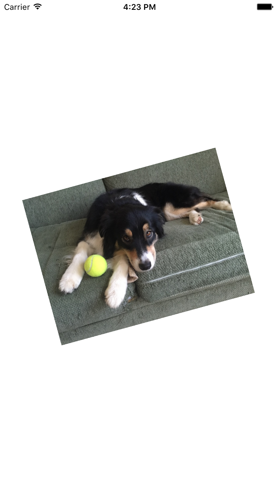

## 2.1 Lecture - Gestures and 3D Touch ##

Learn how to use the iOS touch gestures to interact with your app and it's content.



## 2.2 Tutorial - 3D Touch and Font Sizes ##

3D Touch input enables a new dimension of input into your iPhone app.

>On 3D Touch capable devices, touch pressure changes cause touchesMoved:withEvent: to be called for all apps running on iOS 9.0. When running iOS 9.1, the method is called only for apps linked with the iOS 9.0 (or later) SDK.
>
>Apps should be prepared to receive touch move events with no change in the x/y coordinates.

1. Create two labels

	
	
2. Connect the labels to outlets: `touchLabel` and `fontSizeLabel`
3. Override the touchesMoved(_: withEvent:) method
4. Check if force touch is enabled using the ViewController `traitCollection.forceTouchCapability`
5. Resize the label using force touch data

	```swift
	class ViewController: UIViewController {
	
		@IBOutlet weak var touchLabel: UILabel!
		@IBOutlet weak var fontSizeLabel: UILabel!
		
		override func viewDidLoad() {
			super.viewDidLoad()
		}
		
		override func touchesMoved(touches: Set<UITouch>, withEvent event: UIEvent?) {
			print("move")
			if let touch = touches.first where traitCollection.forceTouchCapability == .Available {
				print("Force: \(touch.force) Max:\(touch.maximumPossibleForce)")
				
				touchLabel.text = "\(touch.force)"
				
				var fontSize = 17 * touch.force
				fontSize = max(17, fontSize) // prevent label from disappearing
				
				fontSizeLabel.font = UIFont.systemFontOfSize(fontSize)
				
			} else {
				touchLabel.text = "3D touch not available"
			}
		}
	}
	```

### Links ###

* [iOS 9.1 Release Notes - 3D Touch](https://developer.apple.com/library/ios/releasenotes/General/RN-iOSSDK-9.1/)
* [Additional 3D Touch Resources](https://developer.apple.com/ios/3d-touch/)

## 2.3 Tutorial - Tap Gesture and UILabels ##

1. Create a method to handle a tap gesture

	```swift
	func handleTapGesture(tapGesture: UITapGestureRecognizer) {
		let location = tapGesture.locationInView(view)
		print("tap:", location)
		addLabel(location)
	}
	
	func addLabel(location: CGPoint) {
		let label = UILabel()
		label.text = "Tap"
		label.sizeToFit()
		label.center = location
		label.backgroundColor = UIColor.blackColor()
		label.textColor = UIColor.whiteColor()
		view.addSubview(label)
	}
	```

2. Create a UITapGestureRecognizer

	```swift
	override func viewDidLoad() {
		super.viewDidLoad()
	
		// Tap Gesture
		let tapGesture = UITapGestureRecognizer(target: self, action: #selector(handleTapGesture))
		view.addGestureRecognizer(tapGesture)
	}
	```

## 2.4 Tutorial - Long Press Gesture to Remove Labels ##

1. Keep track of labels when adding them using an Array

	```swift
	var labelArray = [UILabel]()
	
	func addLabel(location: CGPoint) {
		let label = UILabel()
		label.text = "Tap"
		label.sizeToFit()
		label.center = location
		label.backgroundColor = UIColor.blackColor()
		label.textColor = UIColor.whiteColor()
		view.addSubview(label)
		
		labelArray.append(label) // keep track of labels
	}
	```

2. Add a method for the long press gesture to remove labels

	```swift
	func handleLongPressGesture(longPress: UILongPressGestureRecognizer) {
		
		for label in labelArray {
			label.removeFromSuperview()
		}
		
		// Clear array
		labelArray.removeAll()
	}
	```

3. Add a UILongPressGestureRecognizer

	```swift
	override func viewDidLoad() {
			super.viewDidLoad()
			
			// Tap Gesture
			let tapGesture = UITapGestureRecognizer(target: self, action: #selector(handleTapGesture))
			view.addGestureRecognizer(tapGesture)
			
			let longPressGesture = UILongPressGestureRecognizer(target: self, action: #selector(handleLongPressGesture(_:)))
			view.addGestureRecognizer(longPressGesture)
	}
	```

## 2.5 Tutorial - Image Scale With Pinch Gesture ##

1. Add an UIImageView in viewDidLoad()

	```swift
	let image = UIImage(named: "Row.jpg")!
	
	let imageView = UIImageView(image: image)
	imageView.userInteractionEnabled = true
	imageView.center = view.center
	
	let aspectRatio = image.size.width / image.size.height
	imageView.bounds.size.width = 400
	imageView.bounds.size.height = imageView.bounds.size.width / aspectRatio
	
	imageView.backgroundColor = UIColor.blackColor()
	imageView.contentMode = .ScaleAspectFit
	
	view.addSubview(imageView)
	```

2. Add a UIPinchGestureRecognizer in viewDidLoad()

	```swift
	let pinchGesture = UIPinchGestureRecognizer(target: self, action: #selector(handlePinchGesture))
	imageView.addGestureRecognizer(pinchGesture)
	```

3. Implement the handlePinchGesture(_:) method

	```swift
	func handlePinchGesture(pinchGesture: UIPinchGestureRecognizer) {
		let scale = pinchGesture.scale
		if let imageView = pinchGesture.view as? UIImageView {
			imageView.transform = CGAffineTransformScale(imageView.transform, scale, scale)
		}
		pinchGesture.scale = 1
	}
	```

## 2.6 Tutorial - Image Rotate With Rotation Gesture ##

1. Add a UIRotationGestureRecognizer in viewDidLoad()

	```swift
	let rotateGesture = UIRotationGestureRecognizer(target: self, action: #selector(handleRotationGesture))
	imageView.addGestureRecognizer(rotateGesture)
	```

2. Implement the handleRotationGesture(_:) method

	```swift
	func handleRotationGesture(rotateGesture: UIRotationGestureRecognizer) {
		let rotation = rotateGesture.rotation
		if let imageView = rotateGesture.view as? UIImageView {
			imageView.transform = CGAffineTransformRotate(imageView.transform, rotation)
		}
		rotateGesture.rotation = 0
	}
	```

## 2.7 Tutorial - Image Translation With Pan Gesture ##

1. Add a UIPanGestureRecognizer in viewDidLoad()

	```swift
	let panGesture = UIPanGestureRecognizer(target: self, action: #selector(handlePanGesture))
	imageView.addGestureRecognizer(panGesture)
	```

2. Implement the handlePanGesture(_:) method

	```swift
	func handlePanGesture(panGesture: UIPanGestureRecognizer) {
		let translation = panGesture.translationInView(view)
		if let imageView = panGesture.view as? UIImageView {
			imageView.center.x += translation.x
			imageView.center.y += translation.y
		}
		panGesture.setTranslation(CGPointZero, inView: view)
	}
	```

## 2.8 Tutorial - Multiple Gestures With Gesture Delegate ##

 1. Conform to the UIGestureRecognizerDelegate

	```swift
	class ViewController: UIViewController, UIGestureRecognizerDelegate {
	```

 2. Set the delegate on the gestures in viewDidLoad()

	```swift
	pinchGesture.delegate = self
	panGesture.delegate = self
	rotateGesture.delegate = self
	```

 3. Implement the `gestureRecognizer(_: shouldRecognizeSimultaneouslyWithGestureRecognizer)` method

	```swift
	func gestureRecognizer(gestureRecognizer: UIGestureRecognizer, shouldRecognizeSimultaneouslyWithGestureRecognizer otherGestureRecognizer: UIGestureRecognizer) -> Bool {
		return true
	}
	```

### Links ###

* [Event Handling Guide for iOS](https://developer.apple.com/library/ios/documentation/EventHandling/Conceptual/EventHandlingiPhoneOS/Introduction/Introduction.html#//apple_ref/doc/uid/TP40009541)
* [UIGestureRecognizer](https://developer.apple.com/library/ios/documentation/UIKit/Reference/UIGestureRecognizer_Class/index.html)
* [UIGestureRecognizerDelegate](https://developer.apple.com/library/ios/documentation/UIKit/Reference/UIGestureRecognizerDelegate_Protocol/index.html#//apple_ref/occ/intf/UIGestureRecognizerDelegate)