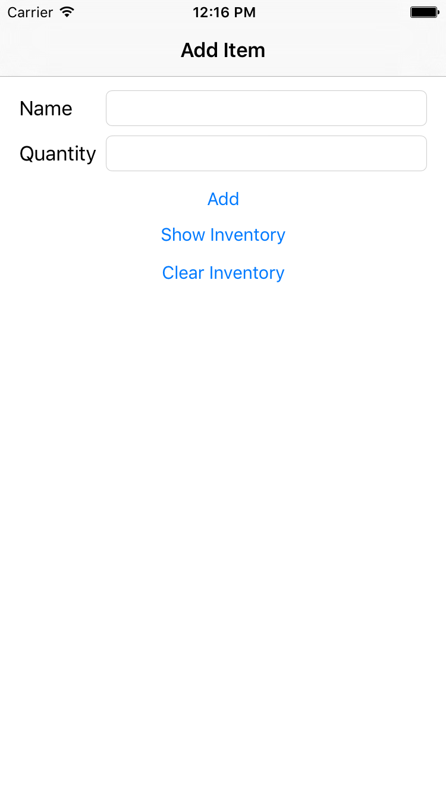

## 4.0 Lesson - Save and Load Using Archives ##

Paul Solt - [Paul@SuperEasyApps.com](mailto:Paul@SuperEasyApps.com)
[SuperEasyApps.com](http://SuperEasyApps.com)

-----

* [4.0 Lesson - Save and Load Using Archives](http://courses.supereasyapps.com/courses/chapter-5-app-extras/lectures/972166)


## 4.1 Lecture - Save and Load Using Archives ##

Learn how you can use code to save and load data and settings from your app with the NSCoding protocol.
  
## 4.2 Tutorial - Save and Load Objects With NSCoding ##

1. Create a new file called Item.swift

	```swift
	import Foundation
	class Item: NSObject, NSCoding {
		var name: String
		var quantity: Int
		init(name: String, quantity: Int) {
			self.name = name
			self.quantity = quantity
			super.init()
		}	
		// NSCoding Protocol
		required init?(coder aDecoder: NSCoder) {
			self.name = aDecoder.decodeObjectForKey("name") as! String
			self.quantity = aDecoder.decodeIntegerForKey("quantity")
		}
		func encodeWithCoder(aCoder: NSCoder) {
			aCoder.encodeObject(name, forKey: "name")
			aCoder.encodeInteger(quantity, forKey: "quantity")
		}
		// Enable print() support
		override var description: String {
			return "Name: \(self.name) Quantity: \(self.quantity)"
		}
	}
	```

2. Create a test Item object in viewDidLoad()

	```swift
	override func viewDidLoad() {
		super.viewDidLoad()
		let item = Item(name: "Chair", quantity: 25)
		print("item:", item)
	}
	```

### Links ###

* [NSCoding](https://developer.apple.com/library/ios/documentation/Cocoa/Reference/Foundation/Protocols/NSCoding_Protocol/)
* [Archives and Serialization Programming Guide](https://developer.apple.com/library/ios/documentation/Cocoa/Conceptual/Archiving/Archiving.html#//apple_ref/doc/uid/10000047i)

## 4.3 Tutorial - Saving and Loading Arrays With NSCoding ##

1. Create an Inventory.swift code file

	```swift
	import Foundation
	class Inventory: NSObject, NSCoding {
		var itemArray: [Item]
		override init() {
			self.itemArray = [Item]()
		}
		// NSCoding protocol
		required init?(coder aDecoder: NSCoder) {
			if let itemArray = aDecoder.decodeObjectForKey("itemArray") as? [Item] {
				self.itemArray = itemArray
			} else {
				self.itemArray = [Item]() // new array if it doesn't exist
			}
		}
		func encodeWithCoder(aCoder: NSCoder) {
			aCoder.encodeObject(itemArray, forKey: "itemArray")
		}
		override var description: String {
			return String(itemArray)
		}
	}
	```

## 4.4 Tutorial - Inventory App UI and Segues ##

1. Create the inventory app UI

	

2. Embed the ViewController in a Navigation Controller

3. Add outlets for the UI

	```swift
	@IBOutlet weak var nameTextField: UITextField!
	@IBOutlet weak var quantityTextField: UITextField!
	```

4. Add actions for the UI Add and Clear buttons

	```swift
	@IBAction func clearInventoryButtonPressed(sender: AnyObject) {
	}
	@IBAction func addButtonPressed(sender: AnyObject) {
	}
	```

5. Add a TableViewController

6. Add a "Cell" prototype as a Right Detail UITableViewCell

7. Add a Segue from the Show Inventory button to the TableViewController

8. Set the segue identifier to "ShowInventory"

9. Create the InventoryTableViewController.swift as a subclass of UITableViewController

10. Set a custom class for the Storyboard TableViewController to InventoryTableViewController to link UI to code

## 4.5 Tutorial - Create and Add Items to the Inventory ##

Add logic to add new items to the Inventory class in ViewController

```swift
var inventory = Inventory()

@IBAction func addButtonPressed(sender: AnyObject) {
	let name = nameTextField.text!
	if let quantity = Int(quantityTextField.text!) {
		let item = Item(name: name, quantity: quantity)
		inventory.itemArray.append(item)
	}
}
@IBAction func clearInventoryButtonPressed(sender: AnyObject) {
	inventory.itemArray.removeAll()
}
```

## 4.6 Tutorial - Setup the TableViewController Show Inventory Segue ##

1. Setup the InventoryTableViewController.swift code file

	```swift
	import UIKit
	class InventoryTableViewController: UITableViewController {
		var inventory: Inventory!
		override func tableView(tableView: UITableView, numberOfRowsInSection section: Int) -> Int {
			return inventory.itemArray.count
		}
		override func tableView(tableView: UITableView, cellForRowAtIndexPath indexPath: NSIndexPath) -> UITableViewCell {
			let cell = tableView.dequeueReusableCellWithIdentifier("Cell", forIndexPath: indexPath)
			let item = inventory.itemArray[indexPath.row]
			cell.textLabel?.text = item.name
			cell.detailTextLabel?.text = String(item.quantity)
			return cell
		}
	}
	```

2. Setup the logic for passing the Inventory using the segue identifier: "ShowInventory"

```swift
override func prepareForSegue(segue: UIStoryboardSegue, sender: AnyObject?) {
	if segue.identifier == "ShowInventory" {
		let destinationVC = segue.destinationViewController as! InventoryTableViewController
		destinationVC.inventory = inventory
	}
}
```

## 4.7 Tutorial - Saving Data Using the NSKeyedArchiver ##

1. Reuse the FileHelper.swift code file

	```swift
	import Foundation
	func documentDirectory() -> NSURL {
		return NSFileManager().URLsForDirectory(.DocumentDirectory, inDomains: .UserDomainMask).first!
	}
	func urlInDocumentDirectory(fileName: String) -> NSURL {
		return documentDirectory().URLByAppendingPathComponent(fileName)
	}
	```

2. Add a the `inventoryURL()` to create a file in your Documents directory

	```swift
	func inventoryURL() -> NSURL {
		return urlInDocumentDirectory("inventory.plist")
	}
	```

3. Add the `saveInventory()` method in ViewController.swift

	```swift
	func saveInventory() {
		let path = inventoryURL().path!
		let success = NSKeyedArchiver.archiveRootObject(inventory, toFile: path)
		if !success {
			print("Failed to save file: \(path)")
		}
	}
	```

4. Save after each item is added to the inventory

	```swift
	@IBAction func addButtonPressed(sender: AnyObject) {
		let name = saveNameTextField.text!
		if let quantity = Int(saveQuantityTextField.text!) {
			let item = Item(name: name, quantity: quantity)
			inventory.itemArray.append(item)
		}
		saveInventory()
	}
	```

5. Save after the inventory is cleared

	```swift
	@IBAction func clearInventoryButtonPressed(sender: AnyObject) {
		inventory.itemArray.removeAll()
		saveInventory()
	}
	```

## 4.8 Tutorial - Loading Data Using the NSKeyedUnarchiver ##

1. Add the `loadInventory()` method to the ViewController.swift file

	```swift
	func loadInventory() {
		let path = inventoryURL().path!
		if let inventory = NSKeyedUnarchiver.unarchiveObjectWithFile(path) as? Inventory {
			// use the existing inventory
			self.inventory = inventory
		} else {
			// create a new inventory
			self.inventory = Inventory()
		}
	}
	```

2. Call the `loadInventory()` method in viewDidLoad() inside ViewController.swift

	```swift
	override func viewDidLoad() {
		super.viewDidLoad()
		let item = Item(name: "Chair", quantity: 25)
		print("item:", item)
		loadInventory()
	}
	```

## 4.9 Tutorial - Troubleshooting Saving and Loading with NSCoding ##

When you work on save and load logic if data is missing your app can crash. Try these techniques to fix problems you might encounter:

1. Delete your app from the Simulator or Device after changing save/load format during development
2. Did you add new data to load that is crashing?

	```swift
	self.version = aDecoder.decodeObjectForKey("version") as! String // Crash!
	```
	
3. Always use "if let" to test values instead of force unwrapping your data. Set defaults for new data if it doesn't exist.

	```swift
	var version: String
	override init() {
		self.itemArray = [Item]()
		self.version = "2.0"
	}
	// NSCoding protocol
	required init?(coder aDecoder: NSCoder) {
	//	self.itemArray = aDecoder.decodeObjectForKey("itemArray") as! [Item] // Can crash!
		if let itemArray = aDecoder.decodeObjectForKey("itemArray") as? [Item] {
			self.itemArray = itemArray
		} else {
			self.itemArray = [Item]() // new array if it doesn't exist
		}
	
	//	self.version = aDecoder.decodeObjectForKey("version") as! String // Crash!
		if let version = aDecoder.decodeObjectForKey("version") as? String {
			self.version = version
		} else {
			self.version = "2.0"
		}
	}
	func encodeWithCoder(aCoder: NSCoder) {
		aCoder.encodeObject(itemArray, forKey: "itemArray")
		aCoder.encodeObject(version, forKey: "version")
	}
	```

### Links ###

* [NSCoding](https://developer.apple.com/library/ios/documentation/Cocoa/Reference/Foundation/Protocols/NSCoding_Protocol/)
* [Archives and Serialization Programming Guide](https://developer.apple.com/library/ios/documentation/Cocoa/Conceptual/Archiving/Archiving.html#//apple_ref/doc/uid/10000047i)
