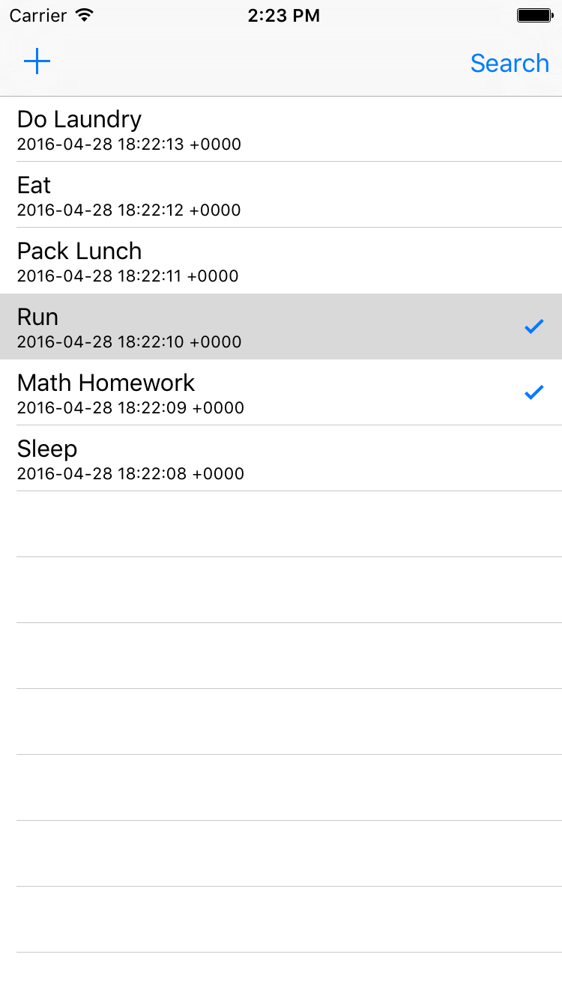

# 5.0 Lesson - Core Data Basics #


Paul Solt - [Paul@SuperEasyApps.com](mailto:Paul@SuperEasyApps.com)
[SuperEasyApps.com](http://SuperEasyApps.com)

-----

* 5.0 Lesson - Core Data Basics

## 5.1 Lecture - Core Data Basics ##

Core Data provides a local database storage mechanism for your app and can reduce the amount of code you need to write and test. If you store more than 500-1000 entries it makes sense to consider it for your local data.

## 5.2 Tutorial - Core Data Managed Object Model ##

The NSManagedObjectModel allows you to describe the data in your app.

1. Create a new file > Core Data > Data Model > named "DataModel.xcdatamodeld"
2. Create a new entity and rename it "Item"
3. Add `title` attribute of type String (lowercase first letter) 
4. Add `done` attribute of type Boolean (Bool)
5. Add `date` attribute of type NSDate
5. Make all attributes non-optional

```swift
import Foundation
import CoreData
class Item: NSManagedObject {
	@NSManaged var title: String
	@NSManaged var done: Bool
	@NSManaged var date: NSDate
}
```

### Optional NSManagedObject Creation ###

Xcode can auto generate the data files, but it will create two files. You can put any custom logic in the file called Item.swift, not the Item+CoreDataProperties.swift file, because Xcode will replace that file if you re-generate the core data attributes.

1. Create a new file called Item, a subclass of NSManagedObject
2. Check: `Use scalar properties for primitive data types`
3. For any non-optional attributes remove the ? from Swift 

## 5.3 Tutorial - Setup the Table View Interface ##



1. Embed ViewController in Navigation Controller
2. Create TableView in Main.storyboard
3. Add Auto Layout constraints
4. Add a prototype cell (Subtitle type)
5. Set the prototype cell identifier "Cell"
6. Add an `+` and a `Search` button to the top corners
7. Connect the actions for the two buttons

	```swift
	@IBAction func addButtonPressed(sender: AnyObject) {
	}
	@IBAction func searchButtonPressed(sender: AnyObject) {
	}
	```
	
8. Connect the TableView outlet as `todoTableView`
9. Set the `delegate` and `dataSource`
10. Add an `itemsArray` property

	```swift
	var itemsArray = [Item]()
	@IBOutlet weak var todoTableView: UITableView!
	
	override func viewDidLoad() {
		super.viewDidLoad()
		todoTableView.dataSource = self
		todoTableView.delegate = self
	}
	```

10. Conform to the protocols: `UITableViewDelegate` and `UITableViewDataSource`

	```swift
	class ViewController: UIViewController, UITableViewDelegate, UITableViewDataSource {
	```

11. Implement the required methods for the DataSource

	```swift
	// Tableview methods
	func tableView(tableView: UITableView, numberOfRowsInSection section: Int) -> Int {
		return itemsArray.count
	}
	
	func tableView(tableView: UITableView, cellForRowAtIndexPath indexPath: NSIndexPath) -> UITableViewCell {
		let cell = tableView.dequeueReusableCellWithIdentifier("Cell", forIndexPath: indexPath)
		configureCell(cell, forIndexPath: indexPath)
		return cell
	}
	func configureCell(cell: UITableViewCell, forIndexPath indexPath: NSIndexPath) {
		let item = itemsArray[indexPath.row]
		cell.textLabel?.text = item.title
		cell.detailTextLabel?.text = String(item.date)
		if item.done {
			cell.accessoryType = .Checkmark
		} else {
			cell.accessoryType = .None
		}
	}
	```


## 5.4 Tutorial - Create a Core Data Manager ##

1. Create a new Swift file: CoreDataManager.swift
2. Create a method to load the documents directory

	```swift
	import Foundation
	import CoreData
	class CoreDataManager {
		var documentDirectory: NSURL = {
			let url = NSFileManager.defaultManager().URLsForDirectory(.DocumentDirectory, inDomains: .UserDomainMask).first
			return url!
		}()
		
	}
	```

3. Setup the core data stack

	```swift
		var managedContext: NSManagedObjectContext
	init() {
		// NOTE: momd extension is compiled model extension (not xcdatamodeld)
		let modelName = "DataModel"
		guard let modelURL = NSBundle.mainBundle().URLForResource(modelName, withExtension: "momd") else {
			fatalError("Unable to find core data model: \(modelName)")
		}
		guard let managedObjectModel = NSManagedObjectModel(contentsOfURL: modelURL) else {
			fatalError("Error initializing managed object model")
		}
		let persistentStoreCoordinator = NSPersistentStoreCoordinator(managedObjectModel: managedObjectModel)
		managedContext = NSManagedObjectContext(concurrencyType: .MainQueueConcurrencyType)
		managedContext.persistentStoreCoordinator = persistentStoreCoordinator
		print("Core Data path:", documentDirectory.path!)
		
		let storeURL = documentDirectory.URLByAppendingPathComponent("\(modelName).sqlite")
		// Crash early to fix programmer errors (with call stack)
		try! persistentStoreCoordinator.addPersistentStoreWithType(NSSQLiteStoreType, configuration: nil, URL: storeURL, options: nil)
	}
	```

4. Add a method to save core data (use try! to fail fast and fix programming errors)

	```swift
	func save() {
		if managedContext.hasChanges {
			// Crash early to fix programmer errors (with call stack)
			try! managedContext.save()
		}
	}
	```
	
5. Create the CoreDataManager in ViewController.swift

	```swift
	lazy var coreData = CoreDataManager()

	```

## 5.5 Tutorial - Add Data to Core Data ##

1. In Item.swift create a helper method to create and insert Items

```swift
	static let entityName = "Item"
	
	static func insertItem(title: String, done: Bool, date: NSDate, managedContext: NSManagedObjectContext) -> Item {
		let item = NSEntityDescription .insertNewObjectForEntityForName(Item.entityName, inManagedObjectContext: managedContext) as! Item
		item.title = title
		item.done = done
		item.date = date
		return item
	}
```

2. Create a method in ViewController.swift to load test data

	```swift
	let taskArray = ["Do Laundry", "Eat", "Pack Lunch", "Run", "Math Homework", "Sleep"]
	func addTestData() {
		for (index, task) in taskArray.enumerate() {
			// Add new data using the current time minus x seconds (1, 2, 3, 4, etc)
			Item.insertItem(task, done: false, date: NSDate(timeIntervalSinceNow: NSTimeInterval(-index)), managedContext: coreData.managedContext)
		}
		coreData.save()
	}
	```

3. Only call the load test data method one time using NSUserDefaults in viewDidLoad()

	```swift
	// Add test data only once
	if nil == NSUserDefaults.standardUserDefaults().valueForKey("didRun") {
		addTestData()
		NSUserDefaults.standardUserDefaults().setBool(true, forKey: "didRun")
	}
	```


## 5.6 Tutorial - Fetch Data From Core Data ##

1. Add a static method to fetch items from core data in Item.swift

	```swift
	static func fetchItemsByDate(managedContext: NSManagedObjectContext) -> [Item] {
		let fetchRequest = NSFetchRequest(entityName: Item.entityName)
		let dateSortDescriptor = NSSortDescriptor(key: "date", ascending: false)
		fetchRequest.sortDescriptors = [dateSortDescriptor]
		let items = try! managedContext.executeFetchRequest(fetchRequest) as! [Item]
		return items
	}
	```

2. Create a method to fetch core data items in ViewController.swift

	```swift
	func fetchCoreData() {
		itemsArray = Item.fetchItemsByDate(coreData.managedContext)
	}
	```

3. Call the method in viewDidLoad()

	```swift
	// Load data from disk
	fetchCoreData()
	```

## 5.7 Tutorial - Add New Todo Items to Core Data ##

1. Add a new method to save a new todo using the title attribute

	```swift
	func saveNewTodo(title: String, done: Bool) {
		Item.insertItem(title, done: done, date: NSDate(), managedContext: coreData.managedContext)
		coreData.save()
		
		fetchCoreData()
		todoTableView.reloadData()
	}
	```

2. Implement the addButtonPressed(_:) method

	```swift
	@IBAction func addButtonPressed(sender: AnyObject) {
		let alertView = UIAlertController(title: "Add Item", message: "New todo?", preferredStyle: .Alert)
		let saveAction = UIAlertAction(title: "Save", style: .Default) { (action: UIAlertAction) in
			print("save")
			if let textField = alertView.textFields?.first {
				self.saveNewTodo(textField.text!, done:false)
			}
		}
		let cancelAction = UIAlertAction(title: "Cancel", style: .Cancel) { (action: UIAlertAction) in
			print("cancel")
		}
		alertView.addAction(saveAction)
		alertView.addAction(cancelAction)
		alertView.addTextFieldWithConfigurationHandler { (textField: UITextField) in
			// customize textfield
		}
		presentViewController(alertView, animated: true, completion: nil)
	}

	```


## 5.8 Tutorial - Modify ManagedObject Properties using Core Data

In ViewController implement the tableView(_:didSelectRowAtIndexPath:) method

```swift
func tableView(tableView: UITableView, didSelectRowAtIndexPath indexPath: NSIndexPath) {
	if let cell = tableView.cellForRowAtIndexPath(indexPath) {
		let item = itemsArray[indexPath.row]
		item.done = !item.done
		// Update the UI
		configureCell(cell, forIndexPath: indexPath)
		coreData.save() // saves done state change
	}
}
```

## 5.9 Tutorial - Delete Todo Items From Core Data ##

Add swipe to delete using the TableView methods:

```swift
func tableView(tableView: UITableView, canEditRowAtIndexPath indexPath: NSIndexPath) -> Bool {
	return true
}
func tableView(tableView: UITableView, commitEditingStyle editingStyle: UITableViewCellEditingStyle, forRowAtIndexPath indexPath: NSIndexPath) {
	if editingStyle == .Delete {
		let itemToDelete = itemsArray[indexPath.row]
		coreData.managedContext.deleteObject(itemToDelete)
		coreData.save()
		// Reload data from Core Data
		fetchCoreData()
		todoTableView.reloadData()
	}
}
```


## 5.10 Tutorial - Search for Items Using Core Data ##

Searches are case and diacritic sensitive by default, add [cd] to disable case and/or diacritic sensitive searches.

1. In Item.swift add a method to search for any Item containing text:

	```swift
	static func fetchItemsContaining(text: String, managedContext: NSManagedObjectContext) -> [Item] {
		let fetchRequest = NSFetchRequest(entityName: Item.entityName)
		let dateSortDescriptor = NSSortDescriptor(key: "date", ascending: true)
		fetchRequest.sortDescriptors = [dateSortDescriptor]
		// Add a search predicate (not case sensitive)
		fetchRequest.predicate = NSPredicate(format: "title CONTAINS[cd] %@", text)
		let items = try! managedContext.executeFetchRequest(fetchRequest) as! [Item]
		return items
	}
	```

2. Add the search and print out results in ViewController.swift's searchButtonPressed(_:) method

	```swift
	@IBAction func searchButtonPressed(sender: AnyObject) {
		let items = Item.fetchItemsContaining("TODO", managedContext: coreData.managedContext)
		print("Search:", items)
	```

3. Enable search for any user input

	```swift
	@IBAction func searchButtonPressed(sender: AnyObject) {
		let alertView = UIAlertController(title: "Search", message: "Find something to do", preferredStyle: .Alert)
		let searchAction = UIAlertAction(title: "Search", style: .Default) { (action: UIAlertAction) in
			if let textField = alertView.textFields?.first {
				let items = Item.fetchItemsContaining(textField.text!, managedContext: self.coreData.managedContext)
				print("Search:", items)
			}
		}
		let cancelAction = UIAlertAction(title: "Cancel", style: .Cancel) { (action: UIAlertAction) in
		}
		alertView.addAction(searchAction)
		alertView.addAction(cancelAction)
		alertView.addTextFieldWithConfigurationHandler { (textField: UITextField) in
			// customize textfield
		}
		presentViewController(alertView, animated: true, completion: nil)
	}
	```

## 5.11 Code Exercise - Search for All Completed Items ##

Add a method to search for all completed items where done is equal to true. You can use a previous fetch and modify the predicate to change what attribute it uses to search.

## 5.12 Solution - Search for All Completed Items ##

1. Add a new search method using a Boolean search NSPredicate in Item.swift

	```swift
	static func fetchItemsWithStatus(completed: Bool, managedContext: NSManagedObjectContext) -> [Item] {
		let fetchRequest = NSFetchRequest(entityName: Item.entityName)
		let dateSortDescriptor = NSSortDescriptor(key: "date", ascending: true)
		fetchRequest.sortDescriptors = [dateSortDescriptor]
		// Add a search predicate (not case sensitive)
		fetchRequest.predicate = NSPredicate(format: "done == %@", completed)
		let items = try! managedContext.executeFetchRequest(fetchRequest) as! [Item]
		return items
	}
	```

2. Call the method in viewDidLoad() and see if it works

	```swift
	let doneItems = Item.fetchItemsWithStatus(true, managedContext: coreData.managedContext)
	print("Done:", doneItems)
	```


### Links ###

* [NSPredicate for searching Core Data](https://developer.apple.com/library/ios/documentation/Cocoa/Conceptual/Predicates/Articles/pSyntax.html)


## 5.14 Bug Fix - Core Data Issues ##

1. Renaming CoreDataModel.xcdatamodeld will cause app to crash on loading ModelObject
2. Using try!, guard, and fatalError("message") to crash early and often (catches programmer bugs)
3. Delete the app and re-run when you change the data model (Show the crash)
4. You don't need to worry about migrating data for your development version (only app store versions)
5. Saves will fail if you don't fill in all the properties from your data model (date not setting example)
6. Using wrong entity name will crash


