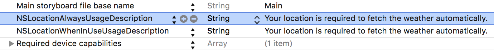

# 8.0 Lesson - Core Location #

Paul Solt - [Paul@SuperEasyApps.com](mailto:Paul@SuperEasyApps.com)
[SuperEasyApps.com](http://SuperEasyApps.com)

-----

* [8.0 Lesson - Core Location](http://courses.supereasyapps.com/courses/chapter-5-app-extras/lectures/1027314)

## 8.1 Lecture - Core Location ##

In this lesson you will learn how to get started with core location and user privacy permissions.

## 8.2 Tutorial - Core Location Setup ##

To enable locations for your app you'll need special settings and permission from the user.

1. Add .plist settings for messages that will display to the user if you need their location.

	
	
	
	```bash
	NSLocationAlwaysUsageDescription
	NSLocationWhenInUseUsageDescription
	```
	
	with the message:
	
	```bash
	Your location is required to fetch the weather automatically.
	```

	
2. In ViewController.swift import the Core Location module

	```swift
	import CoreLocation
	```

3. Add a `cityLabel` outlet

	```swift
	@IBOutlet weak var cityLabel: UILabel!
	```

4. Create the locationManager, set the delegate, and request weather data

	```swift
	let locationManager = CLLocationManager()
	override func viewDidLoad() {
		super.viewDidLoad()
	//		requestWeather()
		updateDate()
		clearWeather()
		
		locationManager.delegate = self
		locationManager.desiredAccuracy =  kCLLocationAccuracyBest
		locationManager.requestWhenInUseAuthorization()
		locationManager.startUpdatingLocation()
	}
	```

5. Conform to the CLLocationManagerDelegate protocol

	```swift
	class ViewController: UIViewController, CLLocationManagerDelegate {
	```

6. Update the requestWeather() method to take a location. Comment out the old request in viewDidLoad()

	```swift
		func requestWeather(location: CLLocationCoordinate2D) {
			// construct URL
	
			let weatherURL = NSURL(string: "\(weatherAPI)/\(apiKey)/\(location.latitude),\(location.longitude)") // US units (miles, F)
	```

7. Implement the location delegate methods

	```swift
	func locationManager(manager: CLLocationManager,
	                     didChangeAuthorizationStatus status: CLAuthorizationStatus)
	{
		print("locationManager didChangeAuthStatus", status.rawValue)
	}
	
	func locationManager(manager: CLLocationManager, didUpdateLocations locations: [CLLocation]) {
		print("locationManager didUpdateLocation", locations)
	}
	
	func locationManager(manager: CLLocationManager, didFailWithError error: NSError) {
		print("ERROR Getting location:", error)
	}
	```

## 8.3 Tutorial - Request Location Placemarks Using CLGeocoder ##

1. Update the locationManager(_: didUpdateLocations:) method

	```swift
	func locationManager(manager: CLLocationManager, didUpdateLocations locations: [CLLocation]) {
		print("locationManager didUpdateLocation")
		// Most recent location is at end of array
		if let location = locations.last {
			updateCityUsingLocation(location)
			requestWeather(location.coordinate)
		}
		// stop updating location, Geocoder is rate limited (so is weather API!)
		manager.stopUpdatingLocation()
	}
	```

2. Implement the updateCityUsingLocation(_:) method using CLGeocoder

	```swift
	func updateCityUsingLocation(location: CLLocation) {
		let geoCoder = CLGeocoder()
		geoCoder.reverseGeocodeLocation(location, completionHandler: { (placemarks: [CLPlacemark]?, error: NSError?) -> Void in
			if let placemark = placemarks?.first {
				if let locality = placemark.locality {
					// update the city
					print("City:", locality)
					self.cityLabel.text = locality
				}
			}
			if let error = error {
				print("Error requesting Geocoding requests:", error)
			}
		})
	}
	```


## 8.4 Tutorial - Requesting User Permission Refined ##

1. Stop requesting location by commenting out the `requestWhenInUseAuthorization()` and `startUpdatingLocation()` methods

	```swift
	override func viewDidLoad() {
		super.viewDidLoad()
		updateDate()
		clearWeather()
		
		locationManager.delegate = self
		locationManager.desiredAccuracy =  kCLLocationAccuracyBest
	//	locationManager.requestWhenInUseAuthorization()
	//	locationManager.startUpdatingLocation()
	}
	```

2. Override `viewDidAppear(_:)` to request permission to get the user's location

	```swift
	override func viewDidAppear(animated: Bool) {
		super.viewDidAppear(animated)
		requestLocationAccess()
	}
	```

3. Implement the new method to request location permission

	```swift
	func requestLocationAccess() {
		print("Request location")
		switch CLLocationManager.authorizationStatus() {
		case .AuthorizedAlways:
			fallthrough
		case .AuthorizedWhenInUse:
			// ...
			print("Location Enabled")
			locationManager.startUpdatingLocation()
			
		case .NotDetermined:
			// First time using app, the user needs to provide permission
			print("Request location access")
			locationManager.requestWhenInUseAuthorization()
	//			locationManager.requestAlwaysAuthorization()
		case .Restricted, .Denied:
			print("Location access disabled")
			showLocationDeniedPopup()
		}
	}
	func showLocationDeniedPopup() {
		// TODO: implement popup logic to the settings app
	}
	```

4. Implement the `showLocationDeniedPopup()` method to have the user change their privacy permissions

	```swift
	func showLocationDeniedPopup() {
		let alertController = UIAlertController(
			title: "Background Location Access Disabled",
			message: "In order to fetch the weather, please open this app's settings and allow location access.",
			preferredStyle: .Alert)
		
		let cancelAction = UIAlertAction(title: "Cancel", style: .Cancel, handler: nil)
		alertController.addAction(cancelAction)
		
		let openAction = UIAlertAction(title: "Open Settings", style: .Default) { (action) in
			// Use dispatch asynch to fix bug when returning from settings app
			dispatch_async(dispatch_get_main_queue(), {
				if let url = NSURL(string:UIApplicationOpenSettingsURLString) {
					UIApplication.sharedApplication().openURL(url)
				}
			})
		}
		alertController.addAction(openAction)
		self.presentViewController(alertController, animated: true, completion: nil)
	}
	```

5. If the user gives your app permission after saying denying, you might not get location updates. Add the code to enable location data if privacy changes.

	```swift
	func locationManager(manager: CLLocationManager,
	                     didChangeAuthorizationStatus status: CLAuthorizationStatus)
	{
		print("locationManager didChangeAuthStatus", status.rawValue)
	
		// if the user just enabled it, we want to resume location updates
		// This method is called when access is granted
		if status == .AuthorizedAlways || status == .AuthorizedWhenInUse {
			locationManager.startUpdatingLocation()
		}
	}
	```

## 8.5 Tutorial - Testing Core Location Permissions ##

Note: The simulator can be a bit buggy/delayed with location data and simulation. It is best to test on a real device. There are sometimes location requests that happen after a 5-7 second delay when starting the app or after making a request.

1. Cleanup output print statements (ViewController json parsing and WeatherDataPoint)
2. Test the app and see if it creates duplicate weather requests
3. Add a refresh button to the top left corner, connect an action, and implement logic to request weather

	```swift
	@IBAction func refreshButtonPressed(sender: AnyObject) {
		print("refresh")
		locationManager.startUpdatingLocation()
	}
	```

4. Prevent duplicate weather requests with `isFetchingWeather` Bool variable

	```swift
	var isFetchingWeather = false
	
	func locationManager(manager: CLLocationManager, didUpdateLocations locations: [CLLocation]) {
		print("location didUpdateLocation:", locations)
		
		if !isFetchingWeather {
			isFetchingWeather = true
			if let location = locations.last {
				// update the city
				updateCityUsingLocation(location)
				// request the weather
				requestWeather(location.coordinate)
			}
		}
		
		// Stop updating (API usage = $ and Geocoding has API ratelimits)
		locationManager.stopUpdatingLocation()
	}
	```


5. Set a location and test the daily Forecast ... do see the bug with the weather request logic? 

6. Remove viewDidAppear(_:) method and move the request to the `viewDidLoad()` method using performSelector after delay.

	```swift
	override func viewDidLoad() {
		super.viewDidLoad()
		
		updateDate()
		clearWeather()
		
		locationManager.delegate = self
		locationManager.desiredAccuracy = kCLLocationAccuracyBest
		
		performSelector(#selector(requestLocationAccess), withObject: nil, afterDelay: 0.01)
	}	
	```


## 8.6 Tutorial - Testing Core Location on a Real iPhone ##

Try out your app on your real iPhone and in different locations!


### Links ###

* [Location and Maps Programming Guide](https://developer.apple.com/library/ios/documentation/UserExperience/Conceptual/LocationAwarenessPG/Introduction/Introduction.html#//apple_ref/doc/uid/TP40009497) 
* [CLLocationManager](https://developer.apple.com/library/ios/documentation/CoreLocation/Reference/CLLocationManager_Class/#//apple_ref/doc/uid/TP40007125-CH3-SW62)


## 8.7 Tutorial - Getting Started With Map Kit ##

1. Import the MapKit module

```swift
import MapKit
```

1. Add code to display a map


	```swift
	var mapView: MKMapView!
	override func viewDidLoad() {
		// ...
		performSelector(#selector(requestLocationAccess), withObject: nil, afterDelay: 0.01)		
		mapView = MKMapView(frame: self.view.frame)
		view.addSubview(mapView)
		mapView.hidden = true
	}
	```

2. Create a button in the menu bar called `Map` along with an action method

3. Show and hide the map when the button is pressed by toggling the hidden property

	```swift
	@IBAction func mapButtonPressed(sender: AnyObject) {
		mapView.setUserTrackingMode(.Follow, animated: true)
		mapView.showsUserLocation = true
		
		mapView.hidden = !mapView.hidden
	}
	```

4. Refresh the location when the refresh button is pressed

	```swift
	@IBAction func refreshButtonPressed(sender: AnyObject) {
		
		print("refresh pressed")
		locationManager.startUpdatingLocation()
		
		mapView.setUserTrackingMode(.Follow, animated: true)
	}
	```

### Links ###

* [Maps and MapKit](https://developer.apple.com/maps/)

