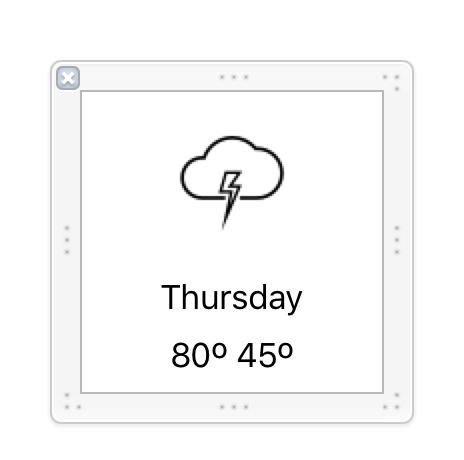

# 9.0 Lesson - Collection View for Grid Based Content #

Paul Solt - [Paul@SuperEasyApps.com](mailto:Paul@SuperEasyApps.com)
[SuperEasyApps.com](http://SuperEasyApps.com)

-----

* [9.0 Lesson - UICollectionView for Grid Based Content](http://courses.supereasyapps.com/courses/chapter-5-app-extras/lectures/1030197)
  
## 9.1 Lecture - UICollectionView for Grid Based Content##

Get started with the grid based view for static or dynamic content. The UICollectionView is an alternative data view to the UITableView.

## 9.2 Tutorial - Collection View Setup ##

1. Create a new GridViewController.swift Swift file
2. Subclass UIViewController and import UIKit

	```swift
	import UIKit
	class GridViewController: UIViewController {
	```

3. Implement viewDidLoad()

	```swift
	@IBOutlet weak var collectionView: UICollectionView!
	override func viewDidLoad() {
		super.viewDidLoad()
		collectionView.delegate = self
		collectionView.dataSource = self
	}
	```

4. Conform to the `UICollectionViewDelegate` and `UICollectionViewDataSource`

	```swift
	class GridViewController: UIViewController, UICollectionViewDelegate, UICollectionViewDataSource {
	```

5. Implement the stubs for two required data source methods with test data

	```swift
	func collectionView(collectionView: UICollectionView, numberOfItemsInSection section: Int) -> Int {
		return 5
	}
	func collectionView(collectionView: UICollectionView, cellForItemAtIndexPath indexPath: NSIndexPath) -> UICollectionViewCell {
		let cell = collectionView.dequeueReusableCellWithReuseIdentifier("FirstCell", forIndexPath: indexPath)
		return cell
	}
	```

6. Create a new UIViewController in your Main.storyboard file
7. Set the class to `GridViewController`
8. Set the Storyboard Identifier to `GridViewController`
9. Set an Opaque Navigation Bar
10. Add a Navigation Item
11. Set the title to `Forecast Grid`
12. Create a UICollectionView
13. Resize it to 150 in height and stretch side to side
14. Connect the Collection View to the `collectionView` outlet in your GridViewController.swift file using the Assistant Editor
15. Make it hold 150x150 cells
16. Add Auto Layout constraints
17. Adjust the FlowLayout to Horizontal
18. Change the Collection View Line spacing to 1 point (horizontal lines)
19. Fix the scroll view offset by unchecking the GridViewController's setting to "Adjust Scroll View Insets" as it will mess up the positioning of content within your UICollectionView

## 9.3 Tutorial - Create a Storyboard CollectionView Cell ##

1. Set the number of cells to 1
2. Add a label or image to the collection view cell
3. Change the cell's identifier to "FirstCell"
4. Make the GridCollectionView as initial view controller to test layout
5. Run the app

## 9.4 Tutorial - Create a Custom UICollectionViewCell and XIB File ##

1. Create a new Cocoa Touch class as a subclass of UICollectionViewCell named `WeatherCollectionViewCell`
2. Check the box for .xib file
3. In the WeatherCollectionViewCell.xib select the collection view cell at set the Reuse Identifier to `Cell`

4. Design the Components for the Weather data (image, day label, and temperature label)

	

5. Connect the outlets to the WeatherCollectionViewCell.swift file

	```swift
	import UIKit
	
	class WeatherCollectionViewCell: UICollectionViewCell {
	
		@IBOutlet weak var imageView: UIImageView!
		
		@IBOutlet weak var dayLabel: UILabel!
		
		@IBOutlet weak var temperatureLabel: UILabel!
		
		
	    override func awakeFromNib() {
	        super.awakeFromNib()
	        // Initialization code
	    }
	
	}
	```

6. Register the custom UICollectionViewCell `Cell` in the viewDidLoad() method of  GridViewController.swift

	```swift
	override func viewDidLoad() {
		super.viewDidLoad()
		collectionView.delegate = self
		collectionView.dataSource = self
		
		// Register custom UICollectionViewCell from an .xib file
		let nib = UINib(nibName: "WeatherCollectionViewCell", bundle: nil)
		collectionView.registerNib(nib, forCellWithReuseIdentifier: "Cell")
	}
	```

7. Update the name of the cell in your GridViewController.swift to `Cell`

```swift
func collectionView(collectionView: UICollectionView, cellForItemAtIndexPath indexPath: NSIndexPath) -> UICollectionViewCell {
	let cell = collectionView.dequeueReusableCellWithReuseIdentifier("Cell", forIndexPath: indexPath)
	return cell
}
```


## 9.5 Tutorial - Connect the Weather Data ##


1. Create a new button to show the Grid and create an action

	```swift
	@IBAction func gridButtonPressed(sender: AnyObject) {
		let gridViewController = storyboard?.instantiateViewControllerWithIdentifier("GridViewController") as! GridViewController
		gridViewController.forecast = weatherForecast
		
		navigationController?.pushViewController(gridViewController, animated: true)
	}
	```
	
2. Add a WeatherForecast property named `forecast` to the GridViewController

	```swift
	var forecast: WeatherForecast?
	```

3. Use the forecast to drive the number of items using the nil coalescing operator

	```swift
	func collectionView(collectionView: UICollectionView, numberOfItemsInSection section: Int) -> Int {
		return forecast?.daily?.dataPoints?.count ?? 0
	}
	```

4. Update the cellForItemAtIndex method to populate with real weather data

	```swift
	func collectionView(collectionView: UICollectionView, cellForItemAtIndexPath indexPath: NSIndexPath) -> UICollectionViewCell {
		let cell = collectionView.dequeueReusableCellWithReuseIdentifier("Cell", forIndexPath: indexPath) as! WeatherCollectionViewCell
		
		if let dailyDataArray = forecast?.daily?.dataPoints {
			
			let dailyForecast = dailyDataArray[indexPath.item]
			
			if let icon = dailyForecast.icon {
				cell.imageView.image = weatherImageForIcon(icon)
			}
			
			if let minTemperature = dailyForecast.minTemperature,
				let maxTemperature = dailyForecast.maxTemperature {
				
				let minTempRounded = Int(round(minTemperature))
				let maxTempRounded = Int(round(maxTemperature))
				
				cell.temperatureLabel.text = "\(maxTempRounded)º \(minTempRounded)º"
			}
	
			if let date = dailyForecast.date {
				cell.dayLabel.text = dayFromDate(date)
			}
			
		}		
		return cell
	}
	```


5. Test the app on the Simulator (set the location to get weather data)

### Links ###

* [Collection View Programming Guide](https://developer.apple.com/library/ios/documentation/WindowsViews/Conceptual/CollectionViewPGforIOS/Introduction/Introduction.html)
* [UICollectionView](https://developer.apple.com/library/ios/documentation/UIKit/Reference/UICollectionView_class/)